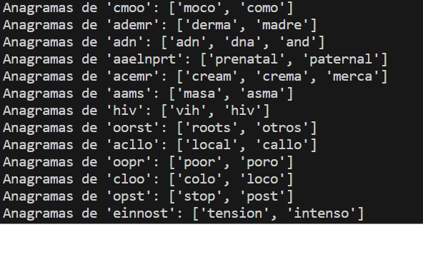

### Trabalho de Casa 1

Nesta primeira aula teórico-prática, foram lançados 10 exercícios, onde serão explorados aqueles que envolveram mais do que uma forma de resolução, bem como o último, que se revelou mais desafiador. 

A título de exemplo, os exercícios 1, 2 e 3 apresentam duas versões, em que uma delas inclui uma resolução com base nas listas de compreensão. 

Relativamente ao primeiro, dado que o resultado esperado consiste numa string invertida, tornou-se essencial utilizar o método join por forma a unir os elementos da lista numa única palavra.
Já para os exercícios 2 e 3, foi utilizada a função len, uma vez que o resultado final se trata de um número (contagens mediante certas condições). Observa-se, portanto: 

' print("Número de a's minúsculos: {} ".format(len([a for a in s if a == "a"]))) 

    
print("Número de A's maiúsculos: {} ".format(len([aa for aa in s if aa == "A"]))) ' 

 Exercício 2  

'return len([letra for letra in s.lower() if letra in vogais])' 

 Exercício 3  

É importante notar que o exercício 8 envolve, também, duas versões, sendo uma delas bastante simples e que é conseguida através de uma única expressão: 'return s2.count(s1)'.

Por outro lado, e de maneira a tornar o exercício mais desafiante, foi considerada uma versão em que se implementou um ciclo for.

Neste caso, o raciocínio baseia-se em string slicing, ou seja, percorrer toda a string s2 de x em x, sendo x o tamanho da string s1, por forma a averiguar se os slices obtidos correspondem a s1. 

Torna-se, portanto, importante utilizar uma variável i, responsável por tomar valores no intervalo de 0 a len(s2) – len(s1) + 1: 

* 
 A subtração deve-se à situação em que se aproxima o fim da string s2, uma vez que não é possível gerar um slice da mesma a partir do seu último caracter. Assim, o slice final deve iniciar-se na posição correspondente a x caracteres antes do fim de s2 (sendo x o tamanho de s1). 

* 
 A incrementação, em uma unidade, reside no facto da função range não considerar o último valor do intervalo, sendo necessário acrescentar uma unidade para este ser atingido.

 O último exercício revelou-se mais laborioso na medida em que foi necessário analisar determinadas inconsistências tais como:
 

* 
 Símbolos como . , ; : - ( ) © / foram substituídos por um espaço em branco. 
 
* 
Eliminação de termos repetidos.
 
* 
Conversão, de todo o texto, em minúsculas, para a comparação ser estabelecida corretamente.
 
* 
Divisão em tokens, de forma a gerar as palavras, individualmente.
 
* 
Eliminação de números, através do método re.sub.
 

A formação do dicionário foi bastante simples, tendo sido descartados, claramente, os caracteres únicos, que não formam anagramas, sendo o resultado final gerado por um ciclo for, de maneira a facilitar a visualização por parte do utilizador.

Na imagem abaixo, encontra-se presente um excerto relativo ao resultado final obtido após execução do código.

  

 

