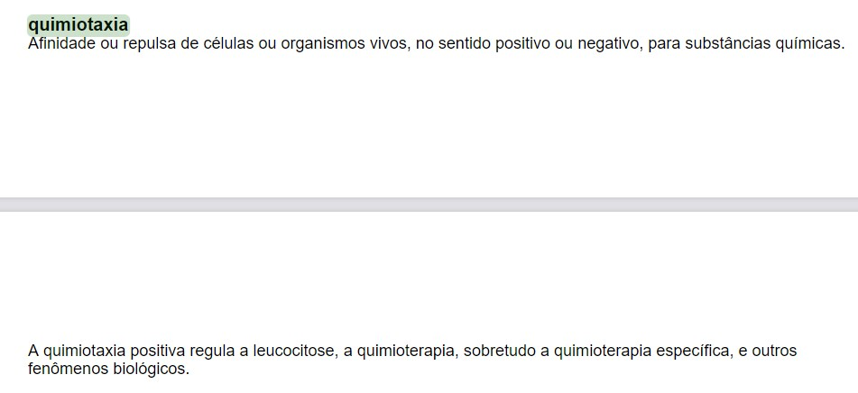
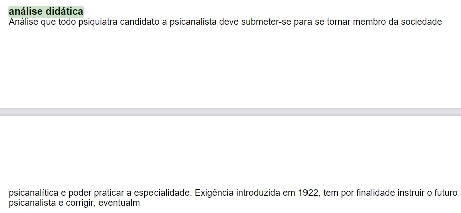
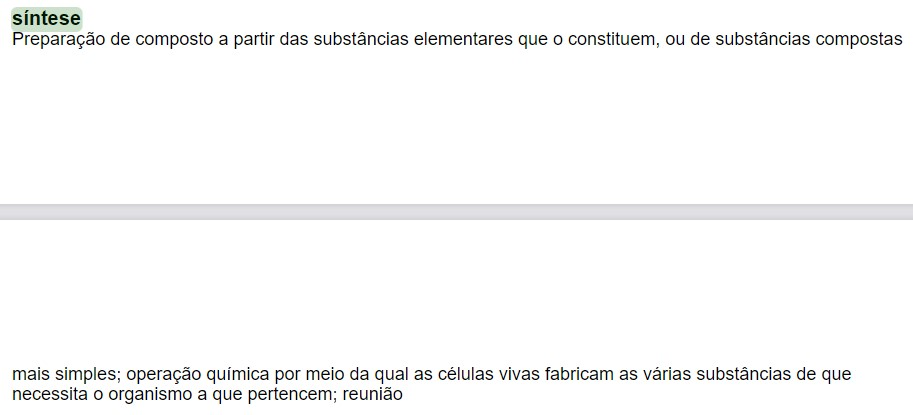
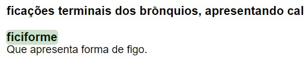
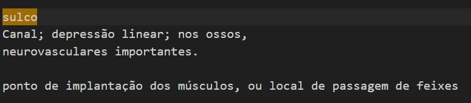
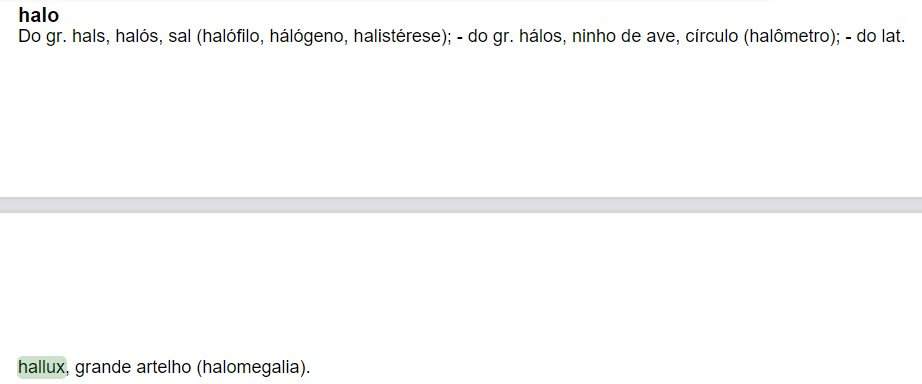
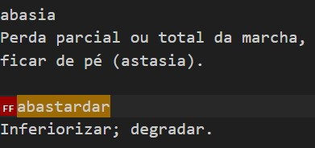
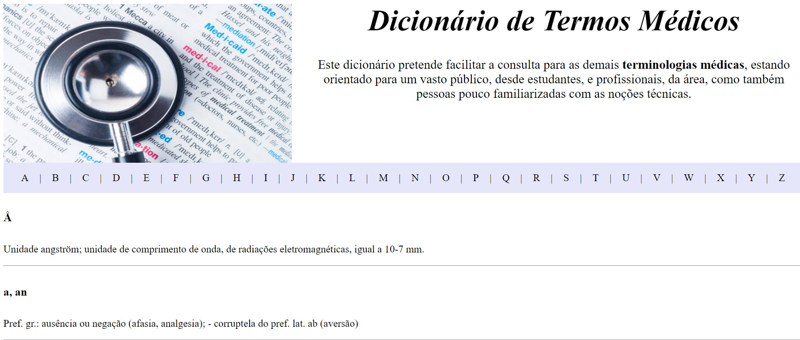

### Trabalho de Casa 3

#### Introdução:

 O presente trabalho de casa permitiu incorporar todo o conhecimento adquirido, acerca das Expressões Regulares, no que se refere ao processamento de documentos de formato <i>pdf.</i> 

 De facto, posso afirmar que a complexidade do desafio, relativamente aos anteriores, aumentou consideravelmente, uma vez que foi necessário estabelecer uma análise minuciosa de um documento de grandes dimensões, por forma a serem identificados os padrões a serem empregues nas funções das expressões regulares. 

#### Desafio lançado:

 Posto isto, o exercício desta semana envolveu o uso de um dicionário constituído por milhares de <b>termos médicos</b>, e respetivas descrições, em formato <i>pdf</i>, tendo sido necessário proceder à sua conversão para um formato <i>txt</i>, algo conseguido pelo comando <i><b>pdftotext</i></b>.

 Todo o processo, até aqui, revelou-se bastante simples, no entanto, a dificuldade aumenta, consideravelmente, quando se pretende converter o mesmo documento, já no formato <i>txt</i>, num ficheiro <i><b>HTML,</i></b> devidamente estruturado, isto é, de maneira a que seja possível identificar, claramente, quais os termos, e quais as suas respetivas descrições. 

 O último passo, descrito anteriormente, foi conseguido durante a execução da aula, em que se colocaram símbolos de <b>"@"</b> como identificação dos termos, tendo sido o restante considerado como descrição. 

 Contudo, o principal obstáculo, residiu na identificação, e tratamento, dos <i><b>form feeds</i></b>, ou seja, quebra de páginas, uma vez que, devido à sua presença, certas descrições eram tratadas como termos. 

#### Tratamento de <i>form feeds </i>:

 De maneira a ser obtida uma estrutura clara, vão ser descritas, a seguir, as expressões regulares utilizadas como contorno ao impasse imposto pelos <i>form feeds:</i>

1.<b>re.sub(r"(\.)\n\n\f([A-RT-Z].+)", r"\1 \2", texto)</b>: Este padrão surge numa situação em que a descrição de um determinado termo, como é o exemplo de <b>quimiotaxia</b>, é interrompida pela quebra de página:

  

 Observa-se que, antes da quebra de página, a descrição termina com um ponto final, seguido de duas mudanças de linha e um <i>form feed</i>, pelo que a sua continuação inicia-se com letra maiúscula. É de notar o intervalo <b>A-RT-Z</b>, uma vez que existe um termo, <b>Sabin, vacina</b>, que se inicia com letra maiúscula. Assim, foi excluída a letra S para não gerar conflito com o mesmo. 

 Como correção, foi apenas considerado, como padrão de substituição, o ponto final e o restante da descrição.

2.<b>re.sub(r"([^\.])\n\n\f([a-z0-9].+[\.,]+.+)", r"\1 \2", texto)</b>: Este padrão ocorre, também, numa situação semelhante à anterior, mas em que a descrição, antes da quebra de página, não termina com um ponto final. Para além disso, a continuação da mesma inicia-se com letra minúscula, ou com um número, na página seguinte. O primeiro caso observa-se em <b>análise didática</b> e o segundo em <b>termômetro centígrado</b>.

  

3.<b>re.sub(r"([^\.])\n\n\f([a-zJ\sâãáàéêóôõúç,;í-]+[\.])", r"\1 \2", texto)</b>: Este padrão não é o mais geral, como é possível averiguar pela presença de vários caracteres acentuados, no entanto, foi essencial para lidar com descrições interrompidas, que incluem esse mesmo tipo de caracteres, ou, ainda, outros sinais de pontuação, terminando, por sua vez, com um ponto final. Tal foi utilizado, por exemplo, em <b>Aquiles, tendão de</b>, cuja expressão interrompida se refere a <b>calcâneo.</b>
 
 É, ainda, de notar a presença da letra <b>J</b> que teve de ser introduzida devido ao termo <b>sopa</b>, cuja interrupção da descrição se iniciava com essa mesma letra.

4.<b>re.sub(r"([^\.])\n\n\f([a-z\sâãáàéêóôõçú;í]+(;.+))", r"\1 \2", texto) </b>: Este padrão é bastante similar ao apresentado acima, contudo, a diferença reside no facto de a descrição, presente na página seguinte, não terminar com ponto final. Tal foi utilizado relativamente ao termo <b>síntese.</b>

  

5.<b>re.sub(r"\n\n\f([A-RT-Z].+)", r"\n\1", texto) </b>: O quinto padrão foi utilizado como uma correção uma vez que, ao longo do processo, denotei que, ao eliminar um <i>form feed</i>, estava também a eliminar a primeira letra, maiúscula, da descrição. Assim, esta expressão faz com que isso não aconteça. 

 Durante todo este processo, maximizei todo o meu esforço na tentativa de gerar expressões regulares mais globais, no entanto, devido à imensidão de termos, tal revelou-se impossível, na medida em que o uso de certas expressões, na correção de termos e descrições, comprometia outros termos. Assim sendo, o que é apresentado a seguir é ainda mais específico e direcionado para termos particulares: 

6.<b>re.sub(r"(ficações terminais dos brônquios, apresentando cal)", r"\1\nSem descrição.\n\n", texto) </b>: Tal como é possível observar na imagem abaixo, a expressão <b>ficações terminais dos brônquios, apresentando cal</b> é um único termo que não detém descrição. Consequentemente, dado que se assumiu que cada termo apresenta, abaixo deste, uma descrição, o termo <b>ficiforme</b>, e respetiva descrição, foram considerados como explicação do termo acima. Posto isto, este padrão faz com que seja adicionada uma descrição ao primeiro termo, neste caso, "Sem descrição", por forma a que ficiforme se encontre na forma correta.

  

7.<b> re.sub(r"(\.)\n\n(.+)(feixes)", r"\1 \2 \3", texto) </b>: Mais uma vez, este padrão refere-se a um termo em particular, neste caso, <b>sulco</b>. Após verificação do ficheiro <i>txt</i>, foi possível denotar que, apesar de não existir nenhuma quebra de página, o fim da descrição encontra-se separada por uma linha, sendo que esta separação se inicia com letra minúscula e termina com a expressão "feixes". Assim sendo, esta foi reposicionada corretamente pelo padrão <b>\1 \2 \3</b>.
 

  

8.<b> re.sub(r"(\.)\n\n\f(hallux.+)", r"\1 \2", texto) </b>: Este padrão foi implementado por um motivo semelhante ao anterior, porém, neste caso, verifica-se a presença de quebra de página, tendo sido, assim, necessário incluir \f na expressão regular. 

  

 Finalmente, e após todo o tratamento das incoerências encontradas, quaisquer <i>form feeds</i> presentes no início dos termos propriamente ditos, sem quaisquer implicações nas descrições, como é exemplo o caso de <b>abastardar</b>, foram simplesmente retirados através de: <b>re.sub(r"\f", r"", texto)</b>

  

#### Construção do Ficheiro HTML:

 Tal como foi mencionado, o objetivo do desafio engloba, também, a geração de um ficheiro <i>HTML</i> a partir do resultado oriundo de todas as etapas de tratamento anteriores. Para tal, e após todos os passos descritos, foi possível proceder à correta distinção entre os termos, através da inserção do símbolo <b>@</b>, e das suas respetivas descrições, dado que é todo o texto que segue um determinado termo antes de nova mudança de linha.

 Uma das funções das expressões regulares, que se revelou extremamente útil, diz respeito à <b><i>findall</i></b> na medida em que foi apenas necessário procurar pelo padrão descrito acima, ou seja: *r"@(.+)* *\n([^@]+)"*, em que o primeiro grupo de captura, a azul, se refere ao termo e o segundo grupo, a vermelho, à descrição. 

 Como se sabe, esta função é responsável por devolver apenas o que se inclui nos grupos de captura, portanto, o resultado é uma lista de tuplos da forma: [(termo1, descrição1), (termo2, descrição2), ...]. Posto isto, todo o processo seguinte torna-se mais fácil dado que é apenas necessário percorrer esta lista para adicionar os respetivos elementos ao ficheiro <i>HTML</i>.

 Inicialmente, são adicionados ao ficheiro uma imagem ilustrativa, juntamente com um resumo acerca do tipo de conteúdo presente, estando estes posicionados como "cabeçalho". Para tal, foi criada uma variável, <b>imagem_e_titulo</b>, cujo valor se trata de um elemento: <b><i>div</b></i>, um elemento próprio do <i>HTML</i> que agrupa vários elementos que são distinguidos através de uma classe, neste caso, a classe de <b><i>image-and-text</b></i>. Todo o restante conteúdo refere-se à apresentação estética dos elementos, tais como a definição da fonte do texto, definição do tamanho, e posição, da imagem, etc. 
 

 Seguidamente, surge a variável <b><i>lista_alfabeto</b></i> que surge mais como um elemento estético. De facto, a ideia inicial consistia na construção de uma barra horizontal, constituída pelas várias letras do alfabeto em que, após seleção de uma das letras, surgiria um menu consistente das palavras iniciadas por aquela mesma letra. No entanto, devido às grandes dimensões do documento, tal não foi possível. Assim, surge, na mesma, uma barra horizontal, composta pelo alfabeto, mas apenas para tornar o ficheiro mais agradável para visualização. 

 As listas, em <i>HTML</i>, são representadas pelas <i>tags</i> <b>< ul ></b> e <b>< li ></b>, no entanto, por <i>default</i> estas geram uma lista vertical e com um <i>bullet styling</i>, ou seja, com marcas (setas, pontos, etc). A primeira é justificada pelo facto da <i>tag</i> <b>li</b> assumir itens de lista com uma disposição em bloco, portanto, para tal ser corrigido, basta mudar o seu <i>display</i> para <i><b>inline-block</b></i>. A segunda situação é passível de ser removida através de <b>list-style: none</b>.

 Após criação da barra, conseguida através da inserção de uma cor de fundo e da definição de valores de <i>padding</i>, foi gerado um ciclo <i>for</i> responsável por percorrer todas as letras do alfabeto e adicioná-las à lista horizontal, encontrando-se estas separadas por uma barra vertical. 

 Por fim, surge a variável <i>body</i> que constitui todos os restantes elementos do ficheiro, isto é, os termos, descrições e separação entre termos por uma linha horizontal. Com isto, foi crucial definir um ciclo <i>for</i>, responsável por percorrer a lista de tuplos referida, e por adicionar todos os elementos ao ficheiro. 

 Finalmente, basta apenas executar o código apresentado abaixo para dar origem ao produto final: 

 <b>html = imagem_e_titulo + lista_alfabeto + body
</b>

<b> file_out = open("aula3.html", "w")
</b>

<b> file_out.write(html)
</b>

<b> file_out.close()
</b>

 Na imagem abaixo, é possível observar um <i>screenshot</i> da estrutura do ficheiro final: 

  

#### Conclusão:

 De facto, penso que este trabalho de casa conseguiu, definitivamente, alcançar um nível superior de complexidade, uma vez que foi necessário procurar, incansavelmente, por incoerências peculiares cuja resolução envolveu a implementação de expressões regulares muito específicas.

 No que toca a estas, considero que, possivelmente, poderiam existir outras formas mais simples, ou mais gerais, de as definir, no entanto, de maneira a atingir um resultado do qual me sentisse orgulhosa, não tive outra alternativa senão aumentar o nível de especificidade das mesmas. 
 

 Adicionalmente, para além de colocar em prática a capacidade de escrita na sintaxe própria das <i>RegEx</i>, este desafio introduziu-nos a um novo mundo: ao mundo do <i>HTML</i> & <i>CSS</i>, permitindo conhecer as mais diversas <i>tags</i> que tornam possível a criação de um ficheiro esteticamente agradável.

 Em suma, considero que o meu nível de dedicação e empenho neste projeto foi bastante alto, na medida em que procurei, incessantemente, por todas as discrepâncias possíveis, tendo sempre testado a coerência da resolução de cada uma. No entanto, apesar desta pesquisa contínua, poderão, de facto, existir certos padrões não abrangidos pelas expressões definidas, o que pode ser compreensível devido à dimensão do documento. 
